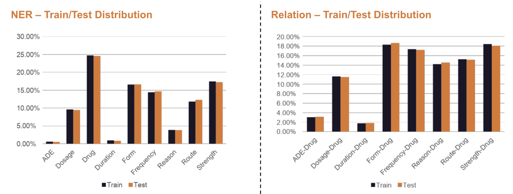

# Medical Concept Extraction and Relationship Classification from Patient Records

## Overview
This project contains code for training and evaluating various named entity recognition (NER) and relation extraction models.

## File Structure
The file structure of this project is as follows:

- `assets`: This directory contains the images used in the README.
- `data`: This directory contains the annotation guidelines in the `ADE_Annotation_Guideline_final.pdf` file. This is from the n2c2 shared task.
- `notebooks`: This directory contains all Jupyter notebooks used in the project.
    - `data_prep`: This directory contains notebooks used for preparing the data for training the models.
        - `data-parser.ipynb`: This notebook contains code for parsing the raw data files.
        - `data-prep-baseline.ipynb`: This notebook contains code for preparing the data for training the baseline NER model.
        - `data-prep-flair.ipynb`: This notebook contains code for preparing the data for training the Flair-based NER model.
        - `umls-data-augmentation.ipynb`: This notebook contains code for augmenting the training data using UMLS concepts.
    - `models`: This directory contains notebooks used for training the models.
        - `ner`: This directory contains notebooks used for training the NER models.
            - `baseline`: This directory contains notebooks used for training the baseline NER model.
                - `ner-baseline.ipynb`: This notebook contains code for training the baseline NER model.
            - `lstm-crf`: This directory contains notebooks used for training the LSTM-CRF NER models.
                - `ner-lstm-crf.ipynb`: This notebook contains code for training the LSTM-CRF NER model.
                - `ner-lstm-crf-umls-augmented.ipynb`: This notebook contains code for training the LSTM-CRF NER model with UMLS-augmented data.
                - `ner-lstm-crf-umls-augmented-weight_exp.ipynb`: This notebook contains code for training the LSTM-CRF NER model with UMLS-augmented data and weight experimentation.
            - `transformer-crf`: This directory contains notebooks used for training the Transformer-CRF NER models.
                - `ner-transformer-crf.ipynb`: This notebook contains code for training the Transformer-CRF NER model.
                - `ner-transformer-crf-augmented.ipynb`: This notebook contains code for training the Transformer-CRF NER model with UMLS-augmented data.
                - `ner-transformer-crf-augmented-weight_exp.ipynb`: This notebook contains code for training the Transformer-CRF NER model with UMLS-augmented data and weight experimentation.
        - `relation_extractor`: This directory contains notebooks used for training the relation extraction models.
            - `rel-baseline.ipynb`: This notebook contains code for training the baseline relation extraction model.
            - `rel-flair.ipynb`: This notebook contains code for training the Flair-based relation extraction model.

## Dataset
Harvard Medical School's "n2c2 adverse drug events (ADE) and medication extraction in the electronic health records" dataset is being used in this project. The dataset cannot be included in this repository as it is not open-source (we have had to sign agreements to gain access to it). However, it is noted that the dataset includes 303 de-identified textual medical records for training and 202 for testing from the MIMIC-III database. For each medical record text file there is also an annotation file with domain expert annotated entity tags and relationship tags. The entity tags include drug, strength, dosage, duration, frequency, form, route, reason, and ADE entity tags, while the relationship tags include strength-drug, dosage-drug, duration-drug, frequency-drug, form-drug, route-drug, reason-drug, and ADE-drug relationship tags. For example, the line "T3 ADE 11270 11293 Abdominal wall hematoma" in the annotation file indicates that the entity with ID "T3" is of type "ADE", occurs from index 11270 to index 11293 in the associated medical record text file, and has the text "Abdominal wall hematoma". Likewise, the line "R1 ADE-Drug Arg1:T3 Arg2:T4" in the annotation file indicates that the relationship with ID "R1" is of type "ADE-Drug", and is between entities with IDs "T3" and "T4".

The following figure shows the entity and relationship tag class distributions for the train and test sets after parsing (further details on the parsing can be found in the report). As can be seen, there is a class imbalance issue, with ADE and Duration being among the least represented for both the entity and relationship tags.

## Dependencies
The models have been trained using the [flair](https://github.com/flairNLP/flair) library. This is a powerful state-of-the-art natural language processing (NLP) library built directly on PyTorch, with special support for biomedical data. It also includes a text embedding library with support to use and combine different word and document embeddings, including Flair embeddings.

The `ColumnCorpus` class to load data into flair. For an example on how to do the same, see [here](https://flairnlp.github.io/docs/tutorial-training/how-to-load-custom-dataset). The following is an example of what a data sample looks like for the NER task after loading it using `ColumnCorpus`:
`Sentence[38]: "Since no new infection was found this was presumed [ * * 12-26 * * ] steroids and the leukocytosis improved with prednisone taper . WBC 12 on day of discharge . Hyperglycemia : Patient is not known" → ["steroids"/Drug, "leukocytosis"/ADE, "prednisone"/Drug, "Hyperglycemia"/ADE]`

We can see the sample text and each entity's text/tag (eg. "steroids"/Drug). Likewise, the following is an example of what a data sample looks like for the relationship extraction task after loading it using `ColumnCorpus`:
`Sentence[29]: "He also may have recurrent seizures which should be treated with ativan IV or IM and do not neccessarily indicate patient needs to return to hospital unless they continue" → ["recurrent seizures"/Reason, "recurrent seizures -> ativan"/Reason-Drug, "ativan"/Drug, "IV"/Route, "IM"/Route]`

We can see the sample text and each entity and relationship's text tag (eg. "recurrent seizures"/Reason for the entity and "recurrent seizures -> ativan"/Reason-Drug for the relationship).

## Usage

Clone this repository and run the Jupyter notebooks in the order specified by their directory names. Note that some notebooks may require additional dependencies.
